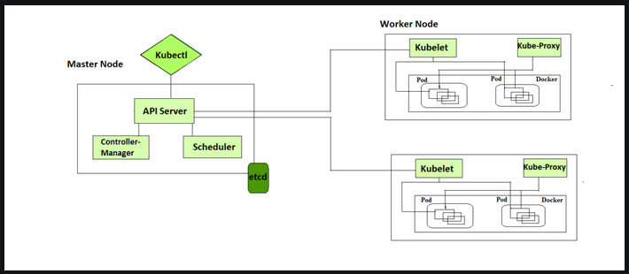

# Kubernetes-YAML-File
Examples of Kubernetes YAML script files About Job, Pod, Container, Service, Deployment, Nodeport, ReplicasController.

## What is Kubernetes (k8s)?
  * Kubernetes is an open-source Container Management tool that automates container deployment, container scaling, descaling, and container
load balancing (also called a container orchestration tool). It is written in Golang and has a vast community because it was first developed
by Google and later donated to CNCF (Cloud Native Computing Foundation). Kubernetes can group ‘n’ number of containers into one logical unit
for managing and deploying them easily. It works brilliantly with all cloud vendors i.e. public, hybrid, and on-premises.

### Why we should create and use the YAML script to deploy a pods ?
  * YAML is a human-friendly language. In the context of Kubernetes, YAML files are mainly used for the configuration of K8 pods, services, and
deployments. In Kubernetes, YAML is a manifest file, which performs the functions mentioned above. They dictate how a pod should run,
interact with other objects, and more.
  * This YAML file is used to create, update, or delete Deployments in a Kubernetes cluster. It contains a set of key-value pairs that specify
various attributes and settings for the Deployment, such as the number of replicas, pod template specifications, labels, and more.

## Architecture of Kubernetes (K8s)

